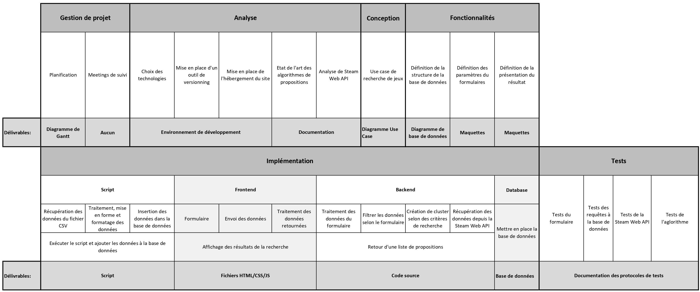
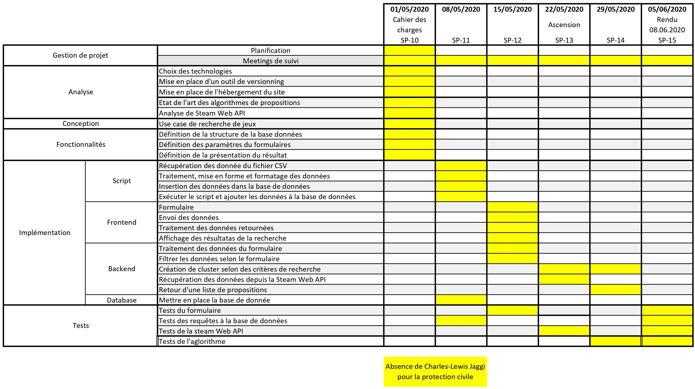

# wem

## Contexte et objectifs du projet

L’objectif est de fournir un outil pour rechercher un jeu sur Steam en fonction de ces préférences et de ses habitudes : 
- Catégories 
- Tag 
- Langue 
- Système d’exploitation 
- Genres 
- … 

On se chargera de fournir à l'utilisateur une liste de recommandation pertinente en fonction de ses jeux, des jeux de ses amis, du score des avis des applications. 

## Données 
### Sources
Sur Kaggle se trouve un dataset de tous les jeux Steam avec des données. Ce dataset contient les infos générales de chaque jeu. 

Si la situation le permet, la Steam Web API pourra être utilisé comme complément avec des requêtes faites directement sur les serveurs Steam. 

### droit d’utilisation 
Ce dataset est libre de droit avec une licence CCO : Public Domain disponible sur le site de Kaggle à l’adresse suivante : 
[Steam games complete dataset](https://www.kaggle.com/trolukovich/steam-games-complete-dataset)

Cette source n’a que 10 mois, on peut donc la considérer encore comme suffisamment récent car les nouvelles sorties sont aujourd’hui suffisamment mises en avant. 

Steam Web API est libre d’utilisation. 

### Description (attributs, quantité) 
#### Dataset
Voici la structure des données qui nous est fournis, elle comporte 20 colonnes et plus de 40'000 entrées (jeux) : 

|Colonne|Description|
|:---:|:–––:|
|url|Url du jeu|
|types|Type de l’article|
|name|Nom du jeu|
|desc_snippet|Description courte du jeu|
|recent_reviews|Avis récent|
|all_reviews|Tous les avis|
|release_date|Date de sortie|
|developer|Développeur du Jeu|
|publisher|Publieur du jeu|
|popular_tags|Tags|
|game_details|Details du jeu|
|languages|Langages supportés|
|achievements|Nombre de succès|
|genre|Genre(s) du jeu|
|game_description|Description du jeu|
|mature_content|Description du contenu mature en jeu|
|minimum_requirements|Spécification matériel minimum pour le jeu|
|recommended_requirements|Spécification matériel recommandé pour le jeu|
|original_price|Prix sans réduction|
|discount_price|Prix avec réduction|
 
### Extraction (méthodes) 
Nous allons utiliser un script en python afin de lire, sérialiser et filtrer le fichier CSV afin de les insérer dans une base de données NoSQL MongoDB. Il se peut que des requêtes REST sur l’API de Steam soit utilisée afin de compléter les données manquantes. 

Pour la Steam Web API, les réponses retournées des requêtes sont déjà extraites, traitées et rendues sous forme JSON qui sera ensuite désérializé. 

## Etat de l'art

## Fonctionnalités

## Conception / Cas d'utilisation / Architecture
### Architecture globale / technologies envisagées 
Nous avons choisi de fournir un outil web pour pouvoir intégrer plus facilement la Steam Web API et fournir une interface plus simplement. Nous avons choisi d’utiliser du Python comme langage de backend afin de profiter d’outils puissants(Scikit-learn, PyTorch) pour faire des manipulations sur de grandes quantités de données comme le clustering. Nous pensons utiliser une base de données NoSQL pour traiter rapidement une grande quantité de données, nous penchons pour MongoDB car connu de tous. Nous comptons utiliser Vue.js pour la partie web, car il permet de mettre en place rapidement des pages web et est étudié en cours de Software Engineering. 

### Techniques, méthodes et algorithmes envisagés pour l’analyse 
Le critère premier qu’utilise un joueur pour choisir un nouveau jeu est son genre (jeu de tir, simulation, etc.). Nous pensons donc classifier les jeux par genre, afin de centrer la recherche sur les types de jeux. Pour améliorer la pertinence des jeux proposer, nous comptons appliquer un clustering sur les tags des jeux. Ainsi le joueur peut orienter sa recherche sur des jeux “Multijoueur”, “Violent”, “Puzzle”, “2D”, etc. A ce stade nous estimons avoir filtré les jeux et orienté la recherche sur le style de jeu qui va intéresser le joueur. La qualité et la pertinence de ces jeux vont ensuite être estimé afin de proposer en priorité les jeux les plus intéressants. Des données telles que sa note pour évaluer sa qualité, son prix pour évaluer en fonction du budget et avoir un ratio qualité/prix, sa date de lancement pour éviter les jeux trop vieux, etc. pourront être utilisés. 

Pour améliorer au fil du temps les propositions, une règle d’association entre les éléments de recherche et les clics sur les liens permettant d’accéder à un jeu sur le store de Steam. 

Par la suite différente, Steam Web API peut être utilisé afin d’améliorer le processus, par exemple en récupérant les jeux que possède le joueur, ainsi que d’intégrer des notions comme la moyenne de temps de jeu, la moyenne du nombre de succès accomplis, etc. 

### Planification des prochaines étapes du projet 
#### WorkPackage 

#### Diagramme de Gantt 

 
# Conclusion
